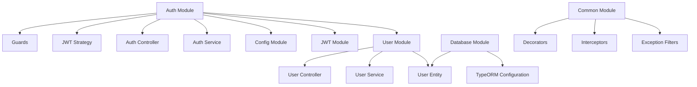
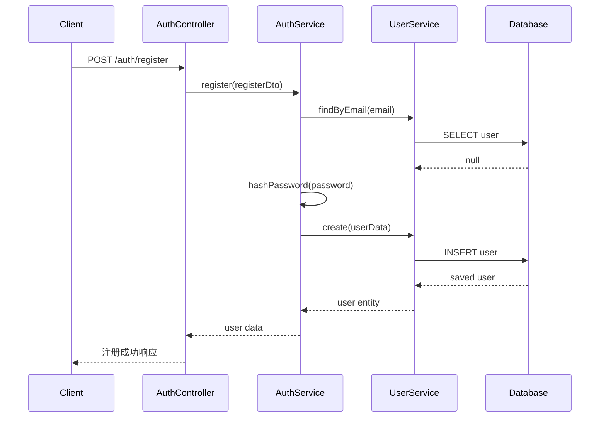
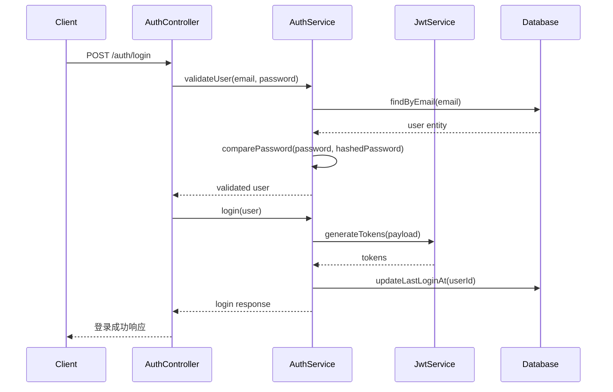
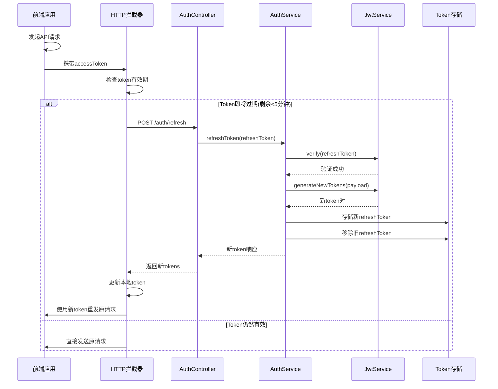
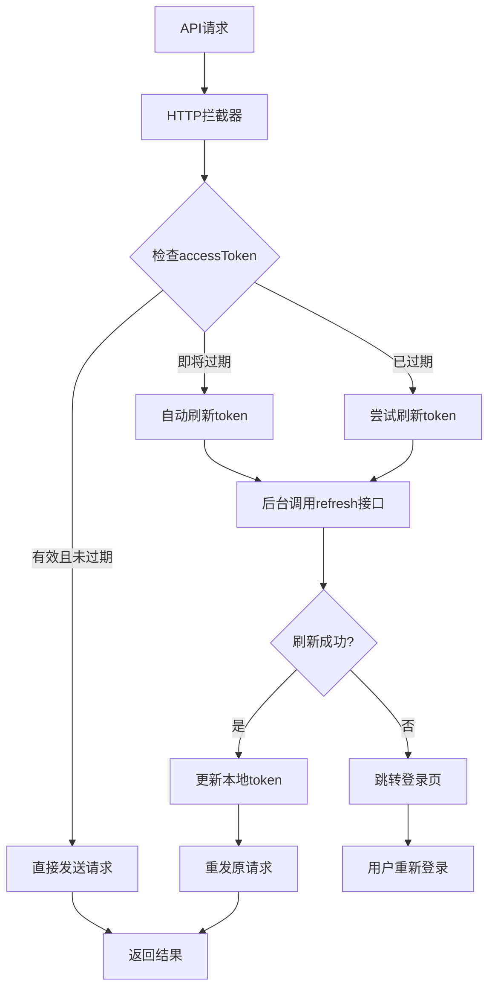
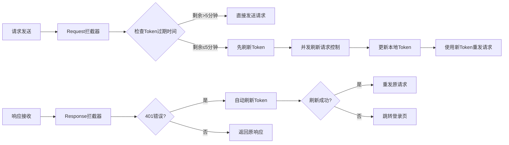
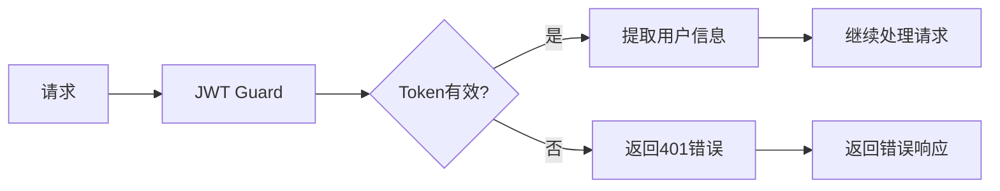
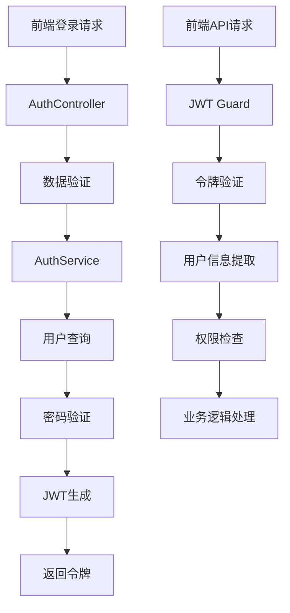
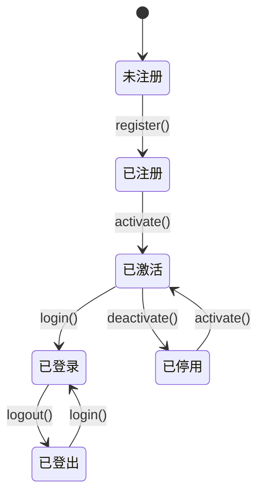

# 登录认证模块设计文档

## 概述

本模块为AI问答知识库前端工程提供完整的登录认证后端支持，基于NestJS框架和TypeORM数据库ORM实现。模块包含用户注册、登录、JWT认证、权限管理等核心功能。

## 技术栈

- **框架**: NestJS
- **数据库ORM**: TypeORM
- **认证**: JWT (JSON Web Token)
- **密码加密**: bcrypt
- **验证**: class-validator + class-transformer
- **数据库**: MySQL/PostgreSQL (推荐PostgreSQL)

## 架构设计

### 模块结构



### 数据模型设计

#### User Entity

| 字段名 | 类型 | 描述 | 约束 |
|--------|------|------|------|
| id | UUID | 用户唯一标识 | 主键 |
| username | VARCHAR(50) | 用户名 | 唯一、非空 |
| email | VARCHAR(100) | 邮箱地址 | 唯一、非空 |
| password | VARCHAR(255) | 密码哈希 | 非空 |
| avatar | VARCHAR(255) | 头像URL | 可空 |
| role | ENUM | 用户角色 | 默认'user' |
| isActive | BOOLEAN | 账户状态 | 默认true |
| lastLoginAt | TIMESTAMP | 最后登录时间 | 可空 |
| createdAt | TIMESTAMP | 创建时间 | 自动设置 |
| updatedAt | TIMESTAMP | 更新时间 | 自动更新 |

#### RefreshToken Entity (无感刷新支持)

| 字段名 | 类型 | 描述 | 约束 |
|--------|------|------|------|
| id | UUID | 令牌ID | 主键 |
| token | VARCHAR(255) | refresh token值 | 唯一、非空 |
| userId | UUID | 用户ID | 外键 |
| expiresAt | TIMESTAMP | 过期时间 | 非空 |
| isRevoked | BOOLEAN | 是否已撤销 | 默认false |
| deviceInfo | VARCHAR(255) | 设备信息 | 可空 |
| ipAddress | VARCHAR(45) | IP地址 | 可空 |
| createdAt | TIMESTAMP | 创建时间 | 自动设置 |
| lastUsedAt | TIMESTAMP | 最后使用时间 | 可空 |

#### Role Entity (可选扩展)

| 字段名 | 类型 | 描述 | 约束 |
|--------|------|------|------|
| id | UUID | 角色ID | 主键 |
| name | VARCHAR(50) | 角色名称 | 唯一 |
| description | VARCHAR(255) | 角色描述 | 可空 |
| permissions | JSON | 权限列表 | 可空 |

## API端点设计

### 认证相关端点

#### POST /auth/register
用户注册

**请求体**:
```json
{
  "username": "string",
  "email": "string", 
  "password": "string"
}
```

**响应**:
```json
{
  "success": true,
  "message": "注册成功",
  "data": {
    "user": {
      "id": "uuid",
      "username": "string",
      "email": "string",
      "avatar": "string",
      "role": "user"
    }
  }
}
```

#### POST /auth/login
用户登录

**请求体**:
```json
{
  "email": "string",
  "password": "string"
}
```

**响应**:
```json
{
  "success": true,
  "message": "登录成功",
  "data": {
    "accessToken": "jwt_token",
    "refreshToken": "refresh_token",
    "user": {
      "id": "uuid",
      "username": "string", 
      "email": "string",
      "avatar": "string",
      "role": "user"
    }
  }
}
```

#### POST /auth/refresh
刷新访问令牌 (无感刷新机制)

**请求体**:
```json
{
  "refreshToken": "string"
}
```

**响应**:
```json
{
  "success": true,
  "message": "令牌刷新成功",
  "data": {
    "accessToken": "new_jwt_token",
    "refreshToken": "new_refresh_token",
    "expiresIn": 900
  }
}
```

#### POST /auth/logout
用户登出

**请求头**: `Authorization: Bearer <token>`

#### GET /auth/profile
获取当前用户信息

**请求头**: `Authorization: Bearer <token>`

### 用户管理端点

#### GET /users/profile
获取用户详细信息

#### PUT /users/profile
更新用户信息

#### PUT /users/password
修改密码

#### POST /users/upload-avatar
上传头像

## 业务逻辑层设计

### AuthService 核心方法

#### 用户注册流程


#### 用户登录流程


#### 无感刷新Token流程


#### Token自动续期机制


#### 主要功能
- `create(createUserDto)`: 创建新用户
- `findByEmail(email)`: 根据邮箱查找用户
- `findByUsername(username)`: 根据用户名查找用户
- `findById(id)`: 根据ID查找用户
- `update(id, updateUserDto)`: 更新用户信息
- `updatePassword(id, newPassword)`: 更新密码
- `deactivate(id)`: 停用用户账户

## 中间件与拦截器

### 无感刷新Token拦截器
#### 前端实现机制


#### 关键特性
- **并发控制**: 防止多个请求同时触发刷新
- **请求队列**: 在刷新期间暂存请求
- **错误重试**: 401错误自动重试机制
- **状态管理**: 全局token状态管理

### JWT认证守卫


### 角色权限守卫
- `@Roles()` 装饰器定义所需角色
- `RolesGuard` 验证用户角色权限
- 支持多角色验证

### 全局异常过滤器
- 统一处理认证相关异常
- 标准化错误响应格式
- 记录错误日志

## 配置管理

### 环境变量配置
```typescript
interface AuthConfig {
  JWT_SECRET: string;
  JWT_EXPIRES_IN: string; // '15m'
  REFRESH_TOKEN_SECRET: string;
  REFRESH_TOKEN_EXPIRES_IN: string; // '7d'
  BCRYPT_ROUNDS: number;
  
  // 无感刷新配置
  AUTO_REFRESH_THRESHOLD: number; // 300 (5分钟)
  REFRESH_TOKEN_ROTATION: boolean; // true
  MAX_REFRESH_ATTEMPTS: number; // 3
  CONCURRENT_REFRESH_PROTECTION: boolean; // true
}
```

### 数据库配置
```typescript
interface DatabaseConfig {
  DB_TYPE: 'mysql' | 'postgres';
  DB_HOST: string;
  DB_PORT: number;
  DB_USERNAME: string;
  DB_PASSWORD: string;
  DB_NAME: string;
  DB_SYNCHRONIZE: boolean;
}
```

## 安全考虑

### 密码安全
- 使用bcrypt进行密码哈希
- 配置适当的salt rounds (推荐12)
- 密码强度验证

### JWT安全
- 短期访问令牌 (15分钟)
- 长期刷新令牌 (7天)
- 令牌黑名单机制
- 安全的密钥管理
- 无感刷新机制
- 令牌自动续期

### 输入验证
- 使用class-validator进行数据验证
- SQL注入防护
- XSS防护
- 请求频率限制

### CORS配置
- 配置允许的前端域名
- 限制允许的HTTP方法
- 设置安全的头部信息

## 单元测试策略

### 测试覆盖范围
- **AuthService测试**
  - 用户注册逻辑
  - 用户登录验证
  - 密码哈希和比较
  - JWT令牌生成和验证

- **UserService测试**
  - CRUD操作
  - 数据验证
  - 异常处理

- **Controller测试**
  - API端点响应
  - 输入验证
  - 错误处理

- **Guard测试**
  - JWT验证逻辑
  - 角色权限检查
  - 异常情况处理

### 测试工具
- Jest: 单元测试框架
- Supertest: API测试
- Test Database: 测试数据库隔离
- Mock Services: 依赖模拟

## 数据流架构

### 认证数据流


### 用户状态管理


## 扩展功能

### 无感刷新Token完整方案

#### 后端实现细节

**RefreshTokenService 核心方法**:
```typescript
// 生成并存储refresh token
createeRefreshToken(userId: string, deviceInfo?: string): Promise<RefreshToken>

// 验证refresh token
validateRefreshToken(token: string): Promise<RefreshToken | null>

// 轮转更新refresh token  
rotateRefreshToken(oldToken: string): Promise<{accessToken: string, refreshToken: string}>

// 撤销用户所有refresh token
revokeAllUserTokens(userId: string): Promise<void>

// 清理过期的refresh token
cleanupExpiredTokens(): Promise<void>
```

**并发刷新控制**:
- 使用Redis锁防止同一用户并发刷新
- 设置刷新请求限流
- 实现刷新令牌的原子性操作

#### 前端集成指导

**Axios拦截器示例** (适用于Vue/React):
```typescript
// 全局状态管理
const tokenManager = {
  refreshPromise: null as Promise<any> | null,
  isRefreshing: false,
  failedQueue: [] as Array<{resolve: Function, reject: Function}>
};

// 请求拦截器
axios.interceptors.request.use((config) => {
  const token = localStorage.getItem('accessToken');
  const tokenExpiry = localStorage.getItem('tokenExpiry');
  
  // 检查token是否即将过期
  if (token && tokenExpiry) {
    const now = Date.now();
    const expiry = parseInt(tokenExpiry);
    
    // 如果5分钟内过期，先刷新
    if (expiry - now < 5 * 60 * 1000) {
      return refreshTokenIfNeeded().then(() => {
        config.headers.Authorization = `Bearer ${localStorage.getItem('accessToken')}`;
        return config;
      });
    }
  }
  
  if (token) {
    config.headers.Authorization = `Bearer ${token}`;
  }
  return config;
});

// 响应拦截器
axios.interceptors.response.use(
  (response) => response,
  async (error) => {
    const originalRequest = error.config;
    
    if (error.response?.status === 401 && !originalRequest._retry) {
      if (tokenManager.isRefreshing) {
        // 如果正在刷新，将请求加入队列
        return new Promise((resolve, reject) => {
          tokenManager.failedQueue.push({ resolve, reject });
        }).then(() => {
          originalRequest.headers.Authorization = `Bearer ${localStorage.getItem('accessToken')}`;
          return axios(originalRequest);
        });
      }
      
      originalRequest._retry = true;
      tokenManager.isRefreshing = true;
      
      try {
        await refreshTokenIfNeeded();
        // 处理队列中的请求
        tokenManager.failedQueue.forEach(({ resolve }) => resolve());
        tokenManager.failedQueue = [];
        
        originalRequest.headers.Authorization = `Bearer ${localStorage.getItem('accessToken')}`;
        return axios(originalRequest);
      } catch (refreshError) {
        // 刷新失败，跳转登录
        tokenManager.failedQueue.forEach(({ reject }) => reject(refreshError));
        tokenManager.failedQueue = [];
        
        localStorage.removeItem('accessToken');
        localStorage.removeItem('refreshToken');
        window.location.href = '/login';
        return Promise.reject(refreshError);
      } finally {
        tokenManager.isRefreshing = false;
      }
    }
    
    return Promise.reject(error);
  }
);

// 刷新token函数
async function refreshTokenIfNeeded() {
  if (tokenManager.refreshPromise) {
    return tokenManager.refreshPromise;
  }
  
  const refreshToken = localStorage.getItem('refreshToken');
  if (!refreshToken) {
    throw new Error('No refresh token available');
  }
  
  tokenManager.refreshPromise = axios.post('/auth/refresh', {
    refreshToken
  }).then(response => {
    const { accessToken, refreshToken: newRefreshToken, expiresIn } = response.data.data;
    
    localStorage.setItem('accessToken', accessToken);
    localStorage.setItem('refreshToken', newRefreshToken);
    localStorage.setItem('tokenExpiry', (Date.now() + expiresIn * 1000).toString());
    
    return response;
  }).finally(() => {
    tokenManager.refreshPromise = null;
  });
  
  return tokenManager.refreshPromise;
}
```

**关键特性**:
1. **智能预刷新**: 在token过期前5分钟自动刷新
2. **并发控制**: 防止多个请求同时触发刷新
3. **请求队列**: 在刷新期间暂存其他请求
4. **错误重试**: 401错误自动尝试刷新
5. **状态持久化**: token和过期时间本地存储

### 社交登录集成
- Google OAuth2
- GitHub OAuth2
- 微信登录

### 多因子认证
- TOTP (Time-based One-Time Password)
- 短信验证码
- 邮箱验证码

### 会话管理
- 会话存储 (Redis)
- 多设备登录管理
- 强制登出功能

### 审计日志
- 登录日志记录
- 操作行为跟踪
- 安全事件监控